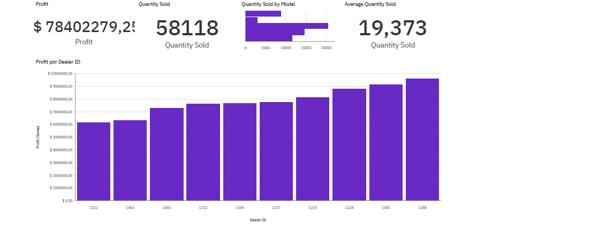

#  Car Sales Performance Dashboard | IBM Cognos Analytics

## Project Overview

Interactive Sales Performance Dashboard built with **IBM Cognos Analytics** to analyze car sales data across multiple dealerships. The goal was to transform raw sales data into clear, actionable visual insights — a key skill in data analysis.

This project was developed as part of the **IBM Data Analyst Professional Certificate** on Coursera, specifically the course [Data Visualization and Dashboards with Excel and Cognos](https://www.coursera.org/learn/data-visualization-dashboards-excel-cognos/).

---

## Business Questions Answered

- What is the total profit and quantity sold across all dealerships?
- Which car models drive the highest sales volume?
- Which dealers are the top and bottom performers by profit?

---

## 📊 Dashboard Features

| Visual | Description |
|---|---|
| 📌 KPI — Total Profit | $78.4M across all dealerships |
| 📌 KPI — Total Quantity Sold | 58,118 units |
| 📌 KPI — Average Quantity Sold | 19,373 units |
| 📊 Bar Chart | Quantity Sold by Car Model |
| 📈 Column Chart | Profit by Dealer ID, sorted ascending to identify top and bottom performers |

---

## Dashboard Preview



---

## 🛠️ Tools & Dataset

| | |
|---|---|
| **Tool** | IBM Cognos Analytics |
| **Dataset** | Car Sales by Model |
| **Course** | Data Visualization and Dashboards with Excel and Cognos — IBM / Coursera |

---

## Key Insights

- Total profit reached **$78.4M**, with significant variation across dealer IDs, highlighting opportunities for performance improvement in underperforming locations.
- Sales volume by car model revealed clear bestsellers, enabling data-driven decisions around inventory and marketing focus.
- Sorting the column chart in ascending order made it straightforward to identify both top performers and dealerships needing attention.

---

## 📁 Repository Structure

```
📦 car-sales-cognos-dashboard
 ┣ 📄 README.md
 ┗ 🖼️ dashboard_screenshot.png
```

--- 
Data Analytics enthusiast | IBM Data Analyst Professional Certificate  
[LinkedIn](https://www.linkedin.com/in/caio-adriano/) <!-- substitua pelo seu link real -->
